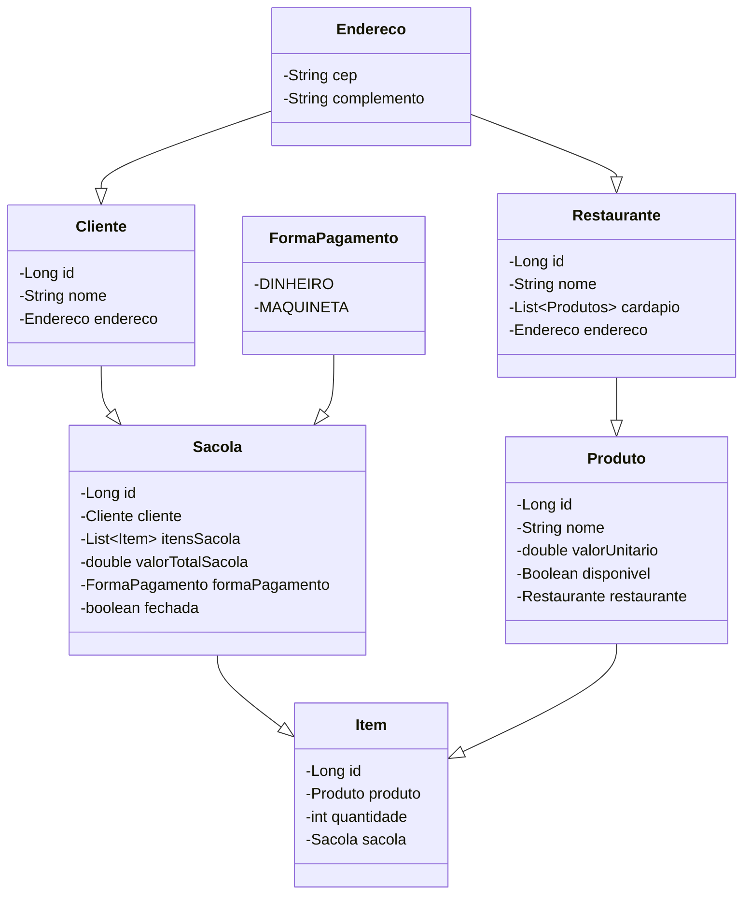

# Market Api

 A shop cart API following an iFood dev week.

## Technologies used:

1. Java 17

2. H2 database

3. Spring Web

4. Spring Data

5. Lombok

6. Gradle

## App functionalities

```mermaid
classDiagram
Cliente --|> Sacola
Cliente : -Long id
Cliente : -String nome
Cliente : -Endereco endereco

Sacola : -Long id
Sacola : -Cliente cliente
Sacola : -List~Item~ itensSacola
Sacola : -double valorTotalSacola
Sacola : -FormaPagamento formaPagamento
Sacola : -boolean fechada

Endereco --|> Cliente
Endereco : -String cep
Endereco : -String complemento

FormaPagamento --|> Sacola
FormaPagamento : -DINHEIRO
FormaPagamento : -MAQUINETA

Endereco --|> Restaurante
Restaurante --|> Produto
Restaurante : -Long id
Restaurante : -String nome
Restaurante : -List~Produtos~ cardapio
Restaurante : -Endereco endereco

Sacola --|> Item
Produto --|> Item
Item : -Long id
Item : -Produto produto
Item : -int quantidade
Item : -Sacola sacola

Produto : -Long id
Produto : -String nome
Produto : -double valorUnitario
Produto : -Boolean disponivel
Produto : -Restaurante restaurante
 
```
